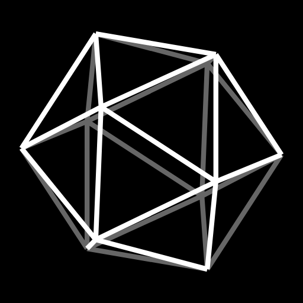

# die Vinci

<p align="center">
  
</p>

die Vinci is an incremental dice game I built around the solids Leonardo drew for Pacioli in 1497. Nine dice in a chain, each one producing the one above it, tetrahedron making ink, ink buying everything. Inspired by Antimatter Dimensions. You start with one die and studies unlock the rest.

I started this game for a loved one, and I still build it for her. It is my passion project.

I play it in the browser. It installs as a PWA, saves locally, runs offline after first visit, and simulates the hours you were away when you come back.

## How it plays

You roll. Faces pay ink with every multiplier you own stacked on top. Every ten of a solid doubles its multiplier. A study unlocks the next die up the chain.

More systems open as you go. The help pane explains each one when it unlocks.

## Run it

You need Node 20 or newer.

```sh
git clone <this repo>
cd die-vinci
npm install
npm run dev
```

`npm run build` typechecks and emits `dist/`. `CHANNEL=dev npm run build` emits `dist-dev/` instead, which serves from `/dev/` on the same host. `npm test` runs the headless Chrome suites, three at a time. `npm run sim` runs a scripted first run and prints where the time went.

Saves live in localStorage with an export string and a file mirror as backup. The service worker takes a new build on next load and reloads once it takes control.

## Versioning

Versions run a.b.c with each segment carrying at nine. `package.json` is the source of truth.

## Credits

Bundles break_infinity.js v2.2.0, MIT, copyright 2019 Timothy Stiles. Dice sounds from Casino Audio 1.1 by Kenney Vleugels, CC0, re-encoded to MP3 so Safari plays them.

## License

MIT. See LICENSE.
